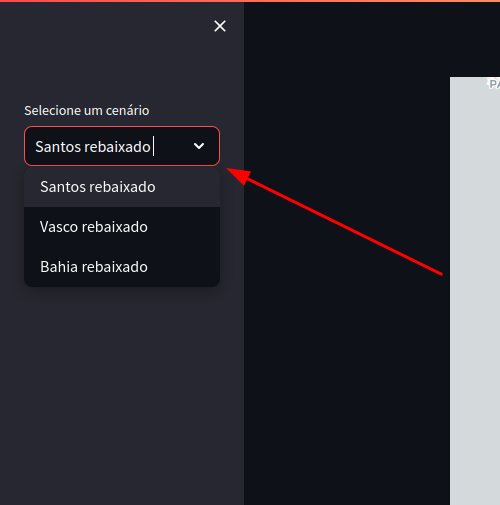
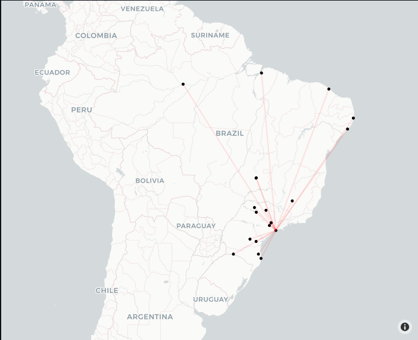
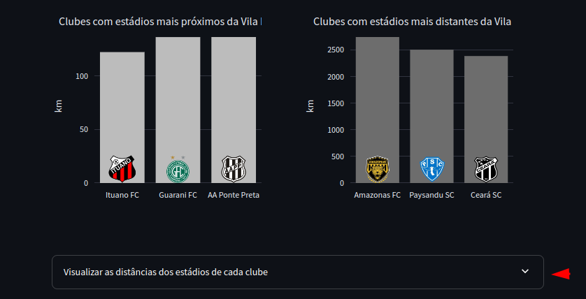
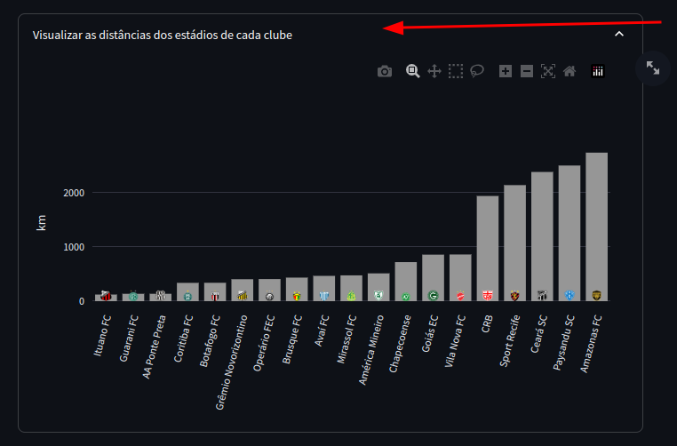
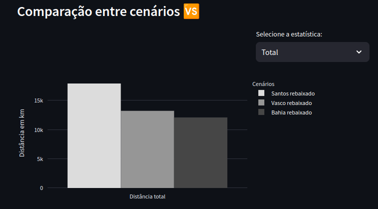
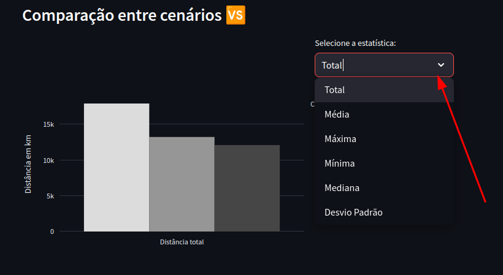
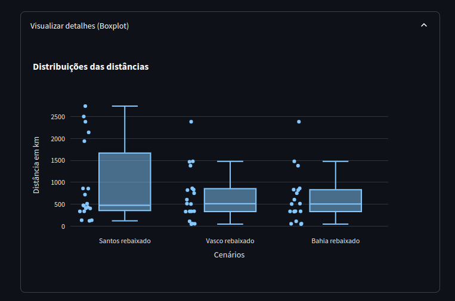
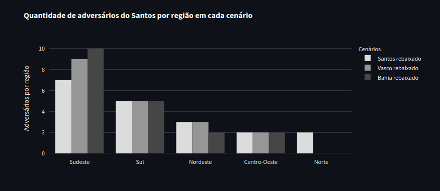
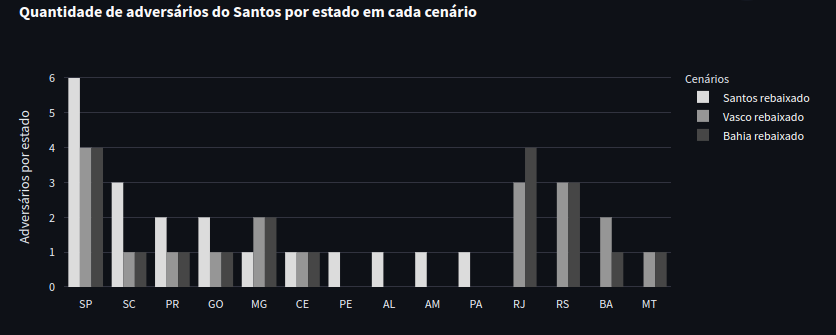

# Distância Vila

## O que é?
Este relatório agrupa as distâncias entre a Vila Belmiro e os demais estádios dos clubes das séries A e B com a finalidade de estabelecer um estudo comparativo das distâncias entre os estádios em três cenários, sendo eles o cenário atual (Santos rebaixado) e dois cenários fictícios com base na última rodada do campeonato brasileiro de 2023 (Vasco rebaixado e Bahia rebaixado).

As distâncias calculadas são apenas entre os estádios, desconsiderando os percursos entre estradas, rodovias e aeroportos.

## Como executar localmente?
Você pode rodar o relatório localmente clonando o atual repositório:

 ```git clone https://github.com/TiagoMPereira/DS-distancia-vila-2024.git```

 Instale os requisitos:

 ```pip install -r requirements.txt```

 Execute o arquivo main.py

 ```streamlit run main.py```

Você também pode acessar o projeto hospedado no streamlit: https://distancia-vila-2024.streamlit.app/

## O projeto


- Na aba esquerda é possível selecionar qual cenário você deseja analisar.

<br><br>


- É possível visualizar a localização de cada estádio a depender do cenário selecionado.
- É possível dar zoom no gráfico para identificar melhor os pontos.
- Cada ponto possui um 'hover' que apresenta as informações do time mandante do estádio.

<br><br>


- Também é possível visualizar os três clubes com menor distância do seu estádio até a Vila bem como com a maior distância.

<br><br>


- Ao expandir o menu é possível visualizar a distância da Vila até os estádios de cada clube.

<br><br>

<br>


- É possível comparar as distâncias entre os cenários selecionando a medida estatística desejada.

<br><br>


- Para mais detalhes sobre as distribuições das distâncias é possível visualizar boxplots para cada cenário.

<br><br>



- Por fim, é possível comparar a quantidade de adversários por região do país e por estado, para cada um dos cenários.